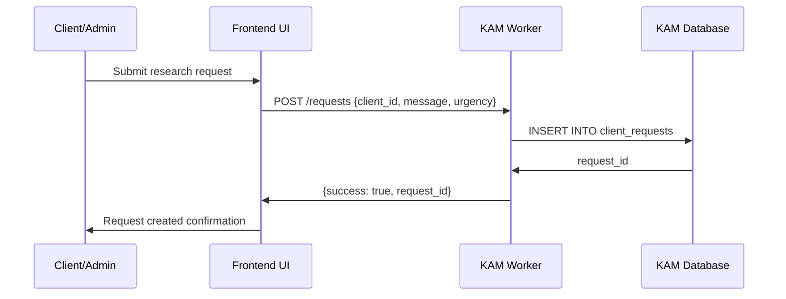
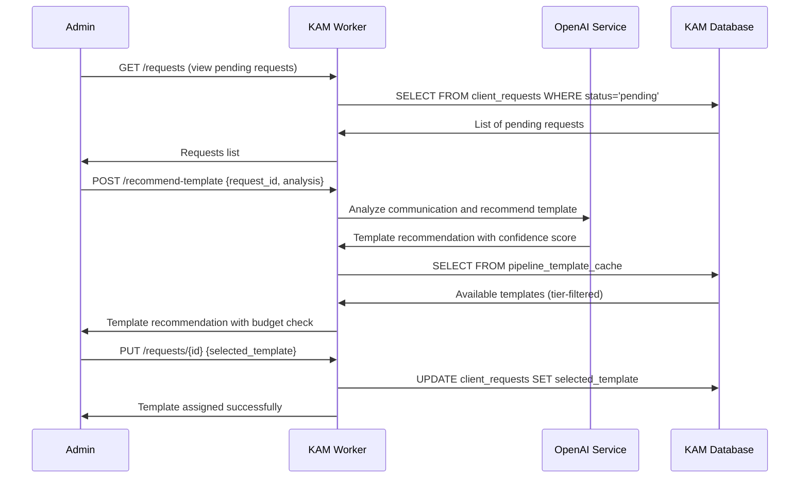
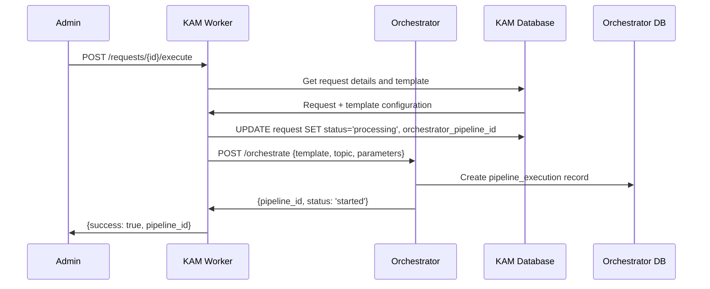
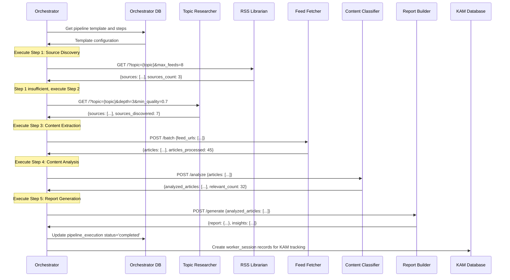
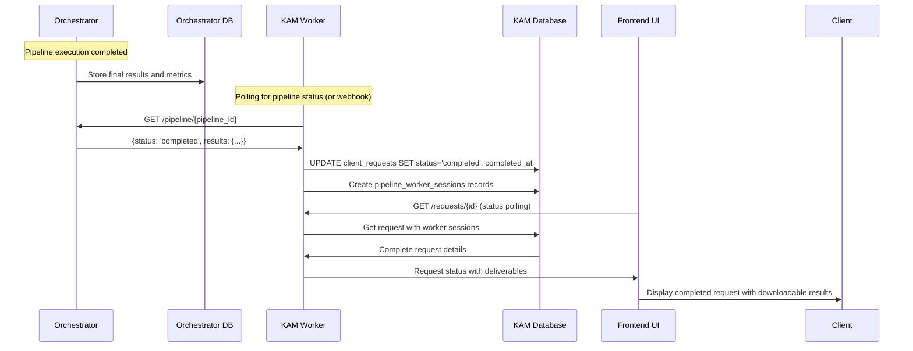

# AI Factory Complete Workflow Analysis

## Executive Summary

This document provides a comprehensive analysis of the AI Factory system's complete workflow from request creation to deliverable delivery. The analysis covers data structures, API contracts, handshake protocols, resource management, and the transition from current v1.0 architecture to the planned Orchestrator 2.0 system.

## Table of Contents

1. [System Architecture Overview](#system-architecture-overview)
2. [Database Schema Analysis](#database-schema-analysis)
3. [API Contract Analysis](#api-contract-analysis)
4. [Complete Workflow Trace](#complete-workflow-trace)
5. [Data Flow Specifications](#data-flow-specifications)
6. [Handshake Protocol Requirements](#handshake-protocol-requirements)
7. [Resource Management Analysis](#resource-management-analysis)
8. [Orchestrator 2.0 Integration Plan](#orchestrator-20-integration-plan)
9. [Implementation Recommendations](#implementation-recommendations)

---

## System Architecture Overview

### Current Production Architecture (v1.0)

```
┌─────────────────┐    ┌─────────────────┐    ┌─────────────────┐
│   Client UI     │◄──►│      KAM        │◄──►│  Orchestrator   │
│                 │    │ (Auth/Client    │    │   (Pipeline     │
│ - Dashboard     │    │  Management)    │    │   Execution)    │
│ - Request Forms │    │                 │    │                 │
│ - Admin Panel   │    │ - Auth          │    │ - Workers       │
└─────────────────┘    │ - Sessions      │    │ - Templates     │
                       │ - Budgets       │    │ - Coordination  │
                       │ - Templates     │    │                 │
                       └─────────────────┘    └─────────────────┘
                                │                       │
                                └───────────────────────┼───────────────────┐
                                                        │                   │
                              ┌─────────────────┐    ┌─────────────────┐  │
                              │  Topic Researcher│    │  RSS Librarian  │  │
                              │  (AI Discovery) │    │  (DB Sources)   │  │
                              └─────────────────┘    └─────────────────┘  │
                                                                          │
                              ┌─────────────────┐    ┌─────────────────┐  │
                              │  Feed Fetcher   │    │Content Classifier│  │
                              │  (RSS Content)  │    │  (AI Analysis)  │  │
                              └─────────────────┘    └─────────────────┘  │
                                                                          │
                              ┌─────────────────┐                        │
                              │ Report Builder  │◄───────────────────────┘
                              │  (Generation)   │
                              └─────────────────┘
```

### Planned Architecture (v2.0 - Orchestrator 2.0)

- **Resource Pooling**: Worker capacity management and intelligent allocation
- **Reference-Based Handshakes**: Minimize data transfer by 80% using D1/KV references
- **Predictive Cost/Time Estimation**: Real-time resource usage forecasting
- **Checkpoint Recovery**: Fault-tolerant execution with state preservation
- **Enhanced Worker Coordination**: Parallel execution with dependency management

---

## Database Schema Analysis

### Key Account Manager (KAM) Database

**Primary Tables:**

1. **`clients`** - Client profile and subscription management
   - `client_id` (PK): Unique client identifier
   - `subscription_tier`: basic | standard | premium | enterprise
   - `monthly_budget_usd`, `used_budget_current_month`: Budget tracking
   - `address`: JSON object with location data

2. **`users`** - Unified authentication system
   - `user_id` (PK): Unique user identifier
   - `role`: admin | client | support
   - `client_id` (FK): Links to clients table when role='client'

3. **`client_requests`** - Request lifecycle tracking
   - `request_id` (PK): Unique request identifier
   - `selected_template`: Pipeline template name
   - `orchestrator_pipeline_id`: Links to orchestrator execution
   - `request_status`: pending | processing | completed | failed

4. **`pipeline_template_cache`** - Cached templates from orchestrator
   - `template_name` (PK): Template identifier
   - `worker_flow`: JSON array of worker execution steps
   - `allowed_tiers`: JSON array of subscription tiers

5. **`template_parameters`** - Detailed parameter definitions
   - `parameter_type`: text | number | select | boolean | file | array
   - `available_tiers`, `editable_tiers`: Tier-based access control
   - `validation_rules`: JSON validation constraints

6. **`pipeline_worker_sessions`** - Worker execution tracking
   - `session_id` (PK): Worker session identifier
   - `worker_name`: Which worker executed
   - `execution_time_ms`, `worker_cost_usd`: Performance metrics

### Orchestrator Database

**Primary Tables:**

1. **`pipeline_executions`** - Pipeline execution tracking
   - `pipeline_id` (PK): Unique pipeline execution identifier
   - `template_name`: Which template was used
   - `total_cost_usd`, `total_execution_time_ms`: Resource consumption
   - `status`: pending | processing | completed | partial | failed

2. **`worker_execution_results`** - Individual worker results
   - `pipeline_id` (FK): Links to pipeline execution
   - `worker_name`: Which worker executed
   - `output_data`: JSON result from worker
   - `success`: Execution success flag

3. **`pipeline_templates`** - Template definitions
   - `name` (PK): Template identifier
   - `complexity_level`: simple | moderate | advanced
   - `estimated_duration_ms`, `estimated_cost_usd`: Resource estimates

4. **`pipeline_steps`** - Template step definitions
   - `template_id` (FK): Links to template
   - `step_order`: Execution sequence
   - `worker_name`: Which worker to execute
   - `input_mapping`, `output_mapping`: Data transformation rules

5. **`worker_registry`** - Worker service definitions
   - `worker_name` (PK): Worker identifier
   - `service_binding`: Cloudflare service binding name
   - `endpoints`: JSON array of available endpoints
   - `input_format`, `output_format`: Data contract specifications

### Individual Worker Databases

**Topic Researcher:**
- `research_sessions`: Tracks research requests
- `discovered_sources`: RSS sources found with quality scores

**Universal Researcher (v2.0):**
- `discovery_sessions`: Multi-platform research tracking
- `discovered_sources`: Platform-agnostic source storage (RSS, YouTube, Podcast, Academic, Social)

---

## API Contract Analysis

### KAM API Endpoints

**Authentication Endpoints:**
- `POST /auth/login` - User authentication, returns session token
- `POST /auth/validate` - Session validation for ongoing requests
- `POST /auth/logout` - Session termination

**Request Management:**
- `GET /requests` - List all requests with filtering
- `POST /requests` - Create new request
- `GET /requests/{id}` - Get request details
- `PUT /requests/{id}` - Update request (assign template)
- `POST /requests/{id}/execute` - Execute template via orchestrator

**Template Management:**
- `GET /templates` - List available templates (tier-filtered)
- `POST /templates/sync` - Sync templates from orchestrator
- `POST /recommend-template` - AI-powered template recommendation

**Client Management:**
- `GET /clients` - List all clients (admin only)
- `POST /clients` - Create new client
- `GET /client/{id}` - Get client details
- `PUT /client` - Update client information

### Orchestrator API Endpoints

**Pipeline Execution:**
- `POST /orchestrate` - Execute pipeline with template
- `GET /pipeline/{id}` - Get pipeline execution status
- `GET /pipeline-history` - List historical executions

**Template Management:**
- `GET /templates` - List available pipeline templates
- `GET /capabilities` - Get worker capabilities and templates

**Health Monitoring:**
- `GET /health` - Orchestrator health status
- `GET /pipeline-health` - Worker health monitoring

### Individual Worker APIs

**Topic Researcher:**
- `GET /?topic={topic}&depth={1-5}&min_quality={0.0-1.0}` - Discover RSS sources

**RSS Librarian:**
- `GET /?topic={topic}&max_feeds={num}` - Get curated sources from database

**Feed Fetcher:**
- `GET /?feed_url={url}&max_articles={num}` - Fetch articles from single RSS feed
- `POST /batch` - Batch process multiple RSS feeds

**Content Classifier:**
- `POST /analyze` - Analyze articles for relevance and quality

**Report Builder:**
- `POST /generate` - Generate formatted intelligence report

---

## Complete Workflow Trace

### Phase 1: Request Creation and Processing



**Data Structures:**

```typescript
// Request Creation Payload
interface RequestCreationPayload {
  client_id: string;
  request_type: 'pipeline_execution' | 'information_request' | 'support_request';
  message: string;
  urgency_level?: 'low' | 'medium' | 'high' | 'critical';
  communication_id?: string; // If triggered by email/communication
}

// Database Record Created
interface ClientRequest {
  request_id: string;           // Generated: req_timestamp_random
  client_id: string;
  request_type: string;
  original_message: string;
  processed_request: string;    // AI-cleaned version
  request_status: 'pending';    // Initial status
  created_at: string;          // ISO timestamp
}
```

### Phase 2: Template Selection and Assignment



**Data Structures:**

```typescript
// Template Recommendation Request
interface TemplateRecommendationRequest {
  analysis: {
    intent: string;
    sentiment: number;
    urgency: string;
    confidence: number;
  };
  client_id?: string;
}

// Template Recommendation Response
interface TemplateRecommendation {
  template_name: string;
  confidence_score: number;
  estimated_cost: number;
  estimated_duration_ms: number;
  reasoning: string;
  budget_check?: {
    approved: boolean;
    remaining_budget: number;
    estimated_cost: number;
  };
}
```

### Phase 3: Pipeline Execution Handoff to Orchestrator



**Critical Data Contract - KAM to Orchestrator:**

```typescript
// Orchestration Request (KAM → Orchestrator)
interface OrchestrationRequest {
  // Template and Configuration
  pipeline_template: string;           // Template name from KAM cache
  topic: string;                      // Research topic
  
  // Client Context
  client_id?: string;                 // For resource tracking
  request_id?: string;                // KAM request ID for linkage
  
  // Execution Parameters
  urgency?: 'low' | 'medium' | 'high' | 'critical';
  quality_level?: 'basic' | 'standard' | 'premium' | 'enterprise';
  optimize_for?: 'speed' | 'cost' | 'quality' | 'balanced';
  
  // Resource Constraints
  budget_limit?: number;              // USD limit
  source_discovery_depth?: number;   // 1-5 depth level
  max_articles?: number;              // Article processing limit
  
  // Template Parameters (from KAM template cache)
  template_parameters?: Record<string, any>;
}

// Orchestration Response (Orchestrator → KAM)
interface OrchestrationResponse {
  status: 'ok' | 'error';
  pipeline: {
    id: string;                      // Pipeline execution ID
    status: 'running' | 'completed' | 'partial' | 'failed';
    started_at: string;
    estimated_completion?: string;
  };
  error?: string;
}
```

### Phase 4: Worker Coordination and Execution



**Worker Input/Output Contracts:**

```typescript
// Topic Researcher
interface TopicResearcherInput {
  topic: string;
  depth?: number;        // 1-5, default 3
  min_quality?: number;  // 0.0-1.0, default 0.6
  max_sources?: number;  // default 20
}

interface TopicResearcherOutput {
  sources: Array<{
    url: string;
    domain: string;
    title: string;
    quality_score: number;
    reasoning: string;
  }>;
  sources_discovered: number;
  avg_quality_score: number;
  total_execution_time_ms: number;
}

// Feed Fetcher
interface FeedFetcherInput {
  feed_urls: string[];        // Array of RSS feed URLs
  max_articles_per_feed?: number;  // default 20
}

interface FeedFetcherOutput {
  articles: Array<{
    url: string;
    title: string;
    content: string;
    published_date: string;
    source_url: string;
  }>;
  articles_processed: number;
  feeds_processed: number;
  total_execution_time_ms: number;
}

// Content Classifier
interface ContentClassifierInput {
  articles: Array<{
    url: string;
    title: string;
    content: string;
  }>;
  target_topic: string;
  analysis_depth?: 'basic' | 'standard' | 'detailed';
}

interface ContentClassifierOutput {
  analyzed_articles: Array<{
    url: string;
    title: string;
    relevance_score: number;
    quality_score: number;
    summary: string;
    key_points: string[];
  }>;
  relevant_count: number;
  avg_relevance_score: number;
  total_execution_time_ms: number;
}
```

### Phase 5: Result Compilation and Delivery



**Final Deliverables Structure:**

```typescript
// Complete Request Response
interface CompleteRequestResponse {
  request_id: string;
  client_id: string;
  request_status: 'completed';
  selected_template: string;
  
  // Execution Metrics
  total_execution_time_ms: number;
  total_cost_usd: number;
  
  // Worker Performance
  worker_sessions: Array<{
    worker_name: string;
    execution_time_ms: number;
    worker_cost_usd: number;
    worker_success: boolean;
    deliverables_summary: string;
  }>;
  
  // Final Deliverables
  deliverables: Array<{
    id: string;
    type: 'report' | 'dataset' | 'analysis';
    name: string;
    size: number;
    url?: string;           // Download URL
    content?: any;          // Inline content for small items
  }>;
  
  // Timeline
  created_at: string;
  started_processing_at: string;
  completed_at: string;
}
```

---

## Data Flow Specifications

### Request Creation Flow

1. **Input Validation**
   - Required: `client_id`, `request_type`, `message`
   - Optional: `urgency_level`, `communication_id`
   - Validate client exists and has active subscription
   - Check monthly budget availability

2. **Request Processing**
   - Generate unique `request_id`
   - Apply AI processing to clean/structure message
   - Store in `client_requests` table with status='pending'
   - Link to original communication if applicable

3. **Response Format**
   ```typescript
   {
     success: boolean;
     request_id: string;
     message: string;
     estimated_template_options?: TemplateOption[];
   }
   ```

### Template Selection Flow

1. **Template Discovery**
   - Query `pipeline_template_cache` filtered by client subscription tier
   - Apply keyword matching against `keyword_triggers`
   - Calculate relevance scores

2. **AI Recommendation**
   - Analyze request content using OpenAI
   - Match against template use cases
   - Generate confidence scores
   - Consider client history and preferences

3. **Budget Validation**
   - Calculate estimated costs against remaining monthly budget
   - Factor in tier-based parameter restrictions
   - Generate approval/warning status

### Pipeline Execution Flow

1. **Pre-execution Validation**
   - Verify template exists and is active
   - Validate all required parameters are provided
   - Check client budget approval
   - Generate unique pipeline ID

2. **Worker Coordination**
   - Load pipeline steps from orchestrator database
   - Execute steps sequentially with dependency checking
   - Apply input/output mapping between workers
   - Track execution metrics and costs

3. **Result Processing**
   - Aggregate worker outputs into final deliverable
   - Calculate total costs and execution time
   - Update request status and store metrics
   - Prepare downloadable assets

---

## Handshake Protocol Requirements

### Current Handshake Protocol (v1.0)

**Service Binding Communication:**
- Direct worker-to-worker calls via Cloudflare service bindings
- Full payload transmission for each request
- No state persistence between calls
- Synchronous request/response pattern

```typescript
// Current Worker Call Pattern
const response = await workerBinding.fetch(new Request(url, {
  method: 'POST',
  headers: {
    'Content-Type': 'application/json',
    'X-API-Key': env.CLIENT_API_KEY,
    'X-Worker-ID': 'bitware_orchestrator'
  },
  body: JSON.stringify(fullPayload)  // Complete data transmitted
}));
```

### Proposed Handshake Protocol v2.0

**Reference-Based Data Transfer:**

1. **Data Storage Phase**
   ```typescript
   // Store large datasets in KV/D1 with reference
   const dataReference = await env.PIPELINE_CACHE.put(
     `data_${pipelineId}_${stepId}`, 
     JSON.stringify(largeDataset),
     { expirationTtl: 3600 }  // 1 hour TTL
   );
   ```

2. **Worker Handshake**
   ```typescript
   // Minimal payload with data reference
   interface WorkerHandshake {
     pipeline_id: string;
     step_id: string;
     data_reference: string;      // KV key for data retrieval
     metadata: {
       record_count: number;
       data_type: string;
       estimated_size_mb: number;
     };
     execution_context: {
       client_id: string;
       budget_remaining: number;
       quality_level: string;
     };
   }
   ```

3. **Worker Data Retrieval**
   ```typescript
   // Worker retrieves data using reference
   const inputData = await env.PIPELINE_CACHE.get(handshake.data_reference);
   const parsedData = JSON.parse(inputData);
   
   // Process data and store result with new reference
   const resultReference = await env.PIPELINE_CACHE.put(
     `result_${pipelineId}_${stepId}`,
     JSON.stringify(processedResult)
   );
   ```

**Benefits:**
- **80% Data Transfer Reduction**: Only references and metadata transmitted
- **Improved Reliability**: Large payloads don't hit request size limits
- **Better Caching**: Intermediate results can be cached and reused
- **Fault Tolerance**: Failed workers can resume from stored checkpoints

### Checkpoint-Based Recovery

```typescript
interface PipelineCheckpoint {
  pipeline_id: string;
  completed_steps: number[];
  failed_steps: number[];
  current_step: number;
  data_references: Record<string, string>;  // step_id -> data_reference
  resource_usage: {
    total_cost_usd: number;
    execution_time_ms: number;
    budget_remaining: number;
  };
  created_at: string;
}

// Recovery Process
async function recoverPipeline(pipelineId: string): Promise<PipelineCheckpoint> {
  const checkpoint = await env.ORCHESTRATION_DB
    .prepare('SELECT * FROM pipeline_checkpoints WHERE pipeline_id = ?')
    .bind(pipelineId)
    .first();
    
  if (checkpoint) {
    // Resume from last successful step
    return JSON.parse(checkpoint.checkpoint_data);
  }
  
  throw new Error('No recovery checkpoint found');
}
```

---

## Resource Management Analysis

### Current Resource Tracking

**KAM Database Tracking:**
- `monthly_budget_usd` / `used_budget_current_month` per client
- `pipeline_worker_sessions` for individual worker costs
- Basic aggregation in dashboard stats

**Orchestrator Database Tracking:**
- `total_cost_usd` per pipeline execution
- `worker_execution_results` with individual costs
- `cost_tracking` table for daily aggregations

### Enhanced Resource Management (v2.0)

**Real-Time Resource Allocation:**

```typescript
interface ResourcePool {
  total_capacity: number;           // Total worker capacity
  allocated_capacity: number;      // Currently allocated
  available_capacity: number;      // Available for new requests
  worker_capacity: Record<string, {
    max_concurrent: number;
    current_load: number;
    avg_execution_time_ms: number;
    cost_per_execution: number;
  }>;
}

interface ResourceReservation {
  reservation_id: string;
  pipeline_id: string;
  client_id: string;
  estimated_resources: {
    execution_time_ms: number;
    cost_usd: number;
    worker_requirements: Record<string, number>;
  };
  reserved_at: string;
  expires_at: string;
  status: 'reserved' | 'executing' | 'completed' | 'cancelled';
}
```

**Predictive Cost Estimation:**

```typescript
interface CostEstimation {
  template_name: string;
  input_parameters: Record<string, any>;
  
  // Historical Analysis
  historical_executions: number;
  avg_cost_usd: number;
  avg_execution_time_ms: number;
  success_rate: number;
  
  // Current Prediction
  estimated_cost_usd: number;
  confidence_interval: {
    min_cost: number;
    max_cost: number;
    confidence_level: number;  // 0.0-1.0
  };
  
  // Resource Breakdown
  worker_costs: Record<string, {
    estimated_cost: number;
    execution_time_ms: number;
    cache_hit_probability: number;
  }>;
}
```

**Queue Management:**

```typescript
interface ExecutionQueue {
  queue_id: string;
  client_tier: 'basic' | 'standard' | 'premium' | 'enterprise';
  priority_score: number;          // Higher = more priority
  
  queued_requests: Array<{
    request_id: string;
    client_id: string;
    estimated_execution_time_ms: number;
    estimated_cost_usd: number;
    queued_at: string;
    max_wait_time_ms: number;      // SLA timeout
  }>;
  
  estimated_processing_time_ms: number;
  current_position?: number;
}
```

---

## Orchestrator 2.0 Integration Plan

### Phase 1: Enhanced Template Parsing

**Current State:**
- Templates stored in `pipeline_template_cache` (KAM)
- Basic worker flow as JSON array
- Static cost/time estimates

**Target State:**
- Dynamic template parsing from orchestrator
- Real-time cost calculation based on current load
- Intelligent worker selection based on capacity

```typescript
interface EnhancedTemplate {
  template_id: string;
  name: string;
  version: string;
  
  // Dynamic Configuration
  worker_steps: Array<{
    step_id: string;
    worker_name: string;
    dependencies: string[];       // Other step IDs
    parallel_execution: boolean;
    fallback_workers?: string[];  // Alternative workers
    
    // Resource Requirements
    estimated_cpu_time_ms: number;
    estimated_memory_mb: number;
    estimated_network_calls: number;
    
    // Cost Calculation
    base_cost_usd: number;
    variable_cost_formula: string;  // e.g., "input_size * 0.0001"
  }>;
  
  // Conditional Logic
  execution_conditions: Record<string, any>;
  parameter_validation: Record<string, ValidationRule>;
  
  // Performance Characteristics
  performance_profile: {
    avg_execution_time_ms: number;
    p95_execution_time_ms: number;
    success_rate: number;
    typical_cost_range: [number, number];
  };
}
```

### Phase 2: Worker Pool Coordination

**Resource Allocation Engine:**

```typescript
class ResourceAllocationEngine {
  async allocateWorkers(
    request: OrchestrationRequest,
    template: EnhancedTemplate
  ): Promise<WorkerAllocation> {
    
    // 1. Assess Current Load
    const currentLoad = await this.assessWorkerLoad();
    
    // 2. Calculate Resource Requirements
    const requirements = await this.calculateRequirements(request, template);
    
    // 3. Find Optimal Allocation
    const allocation = await this.findOptimalAllocation(requirements, currentLoad);
    
    // 4. Reserve Resources
    const reservation = await this.reserveResources(allocation);
    
    return {
      allocation,
      reservation,
      estimated_start_time: new Date(),
      estimated_completion_time: new Date(Date.now() + allocation.total_time_ms)
    };
  }
  
  private async findOptimalAllocation(
    requirements: ResourceRequirements,
    currentLoad: WorkerLoad
  ): Promise<WorkerAllocation> {
    // Optimization algorithm considering:
    // - Cost minimization
    // - Time minimization  
    // - Quality requirements
    // - Current worker availability
    // - Historical performance data
  }
}
```

### Phase 3: Predictive Cost/Time Estimation

**Machine Learning Integration:**

```typescript
interface PredictiveModel {
  model_version: string;
  training_data_samples: number;
  last_trained: string;
  accuracy_metrics: {
    cost_prediction_accuracy: number;    // 0.0-1.0
    time_prediction_accuracy: number;    // 0.0-1.0
    success_rate_accuracy: number;       // 0.0-1.0
  };
}

class PredictiveEstimator {
  async estimateExecution(
    template: EnhancedTemplate,
    input_parameters: Record<string, any>,
    client_context: ClientContext
  ): Promise<ExecutionEstimate> {
    
    // Feature Engineering
    const features = this.extractFeatures(template, input_parameters, client_context);
    
    // Model Predictions
    const costPrediction = await this.predictCost(features);
    const timePrediction = await this.predictTime(features);
    const successPrediction = await this.predictSuccess(features);
    
    // Confidence Intervals
    const costConfidence = this.calculateConfidenceInterval(costPrediction);
    const timeConfidence = this.calculateConfidenceInterval(timePrediction);
    
    return {
      estimated_cost_usd: costPrediction.value,
      cost_confidence_interval: costConfidence,
      estimated_time_ms: timePrediction.value,
      time_confidence_interval: timeConfidence,
      success_probability: successPrediction.value,
      model_confidence: Math.min(
        costPrediction.confidence,
        timePrediction.confidence,
        successPrediction.confidence
      )
    };
  }
}
```

### Phase 4: Checkpoint-Based Recovery

**State Management:**

```typescript
interface ExecutionState {
  pipeline_id: string;
  current_checkpoint: PipelineCheckpoint;
  
  // Execution Context
  allocated_resources: WorkerAllocation;
  execution_timeline: ExecutionEvent[];
  
  // Recovery Information
  recovery_points: CheckpointData[];
  last_successful_step: number;
  failed_attempts: number;
  
  // Resource Tracking
  consumed_resources: {
    execution_time_ms: number;
    cost_usd: number;
    worker_usage: Record<string, WorkerUsage>;
  };
}

class CheckpointManager {
  async createCheckpoint(
    pipelineId: string,
    completedStep: number,
    stepResults: any
  ): Promise<string> {
    
    // Store intermediate results
    const dataReference = await this.storeStepResults(pipelineId, completedStep, stepResults);
    
    // Create checkpoint record
    const checkpoint: PipelineCheckpoint = {
      pipeline_id: pipelineId,
      completed_steps: [...this.getCompletedSteps(pipelineId), completedStep],
      data_references: { [completedStep]: dataReference },
      resource_usage: await this.getCurrentResourceUsage(pipelineId),
      created_at: new Date().toISOString()
    };
    
    // Persist checkpoint
    await this.persistCheckpoint(checkpoint);
    
    return checkpoint.checkpoint_id;
  }
  
  async recoverFromCheckpoint(pipelineId: string): Promise<ExecutionState> {
    const latestCheckpoint = await this.getLatestCheckpoint(pipelineId);
    
    if (!latestCheckpoint) {
      throw new Error('No recovery checkpoint available');
    }
    
    // Restore execution state
    const executionState = await this.restoreExecutionState(latestCheckpoint);
    
    // Verify data integrity
    await this.verifyCheckpointData(latestCheckpoint);
    
    return executionState;
  }
}
```

### Phase 5: Deliverable Storage and Retrieval

**Enhanced Storage Architecture:**

```typescript
interface DeliverableStorage {
  storage_backend: 'R2' | 'D1' | 'KV';
  storage_policy: {
    retention_days: number;
    compression: boolean;
    encryption: boolean;
    access_control: 'client_only' | 'admin_accessible' | 'public_read';
  };
}

interface DeliverableMetadata {
  deliverable_id: string;
  pipeline_id: string;
  client_id: string;
  
  // Content Information
  content_type: string;
  file_size_bytes: number;
  checksum: string;
  
  // Storage Information
  storage_location: string;      // R2 key or D1 table reference
  storage_backend: string;
  compressed: boolean;
  encrypted: boolean;
  
  // Access Control
  access_level: 'private' | 'client_shared' | 'public';
  download_url?: string;         // Signed URL for direct access
  expires_at?: string;           // Access expiration
  
  // Metadata
  created_at: string;
  last_accessed?: string;
  download_count: number;
  
  // Business Context
  deliverable_type: 'report' | 'dataset' | 'analysis' | 'visualization';
  format: 'json' | 'pdf' | 'csv' | 'html' | 'xlsx';
  language: string;
  quality_score?: number;
}

class DeliverableManager {
  async storeDeliverable(
    pipelineId: string,
    content: any,
    metadata: Partial<DeliverableMetadata>
  ): Promise<DeliverableMetadata> {
    
    // Choose optimal storage backend
    const storageBackend = this.selectStorageBackend(content, metadata);
    
    // Apply compression if beneficial
    const processedContent = await this.processContent(content, storageBackend);
    
    // Store content
    const storageLocation = await this.storeContent(processedContent, storageBackend);
    
    // Create metadata record
    const deliverableMetadata: DeliverableMetadata = {
      deliverable_id: this.generateDeliverableId(),
      pipeline_id: pipelineId,
      client_id: metadata.client_id!,
      content_type: this.detectContentType(content),
      file_size_bytes: this.calculateSize(processedContent),
      checksum: this.calculateChecksum(processedContent),
      storage_location: storageLocation,
      storage_backend: storageBackend,
      created_at: new Date().toISOString(),
      download_count: 0,
      ...metadata
    };
    
    // Persist metadata
    await this.persistDeliverableMetadata(deliverableMetadata);
    
    return deliverableMetadata;
  }
  
  async retrieveDeliverable(
    deliverableId: string,
    clientId: string
  ): Promise<{ content: any; metadata: DeliverableMetadata }> {
    
    // Get metadata and verify access
    const metadata = await this.getDeliverableMetadata(deliverableId);
    await this.verifyAccess(metadata, clientId);
    
    // Retrieve content from storage
    const content = await this.retrieveContent(
      metadata.storage_location,
      metadata.storage_backend
    );
    
    // Update access tracking
    await this.updateAccessTracking(deliverableId);
    
    return { content, metadata };
  }
}
```

---

## Implementation Recommendations

### Immediate Actions (Next 2 Weeks)

1. **Complete Template Parameter Tables**
   - Run the template-parameters-tables.sql migration
   - Populate template_parameters for existing templates
   - Implement tier-based parameter filtering in frontend

2. **Enhance Request-to-Pipeline Linking**
   - Add orchestrator_pipeline_id foreign key constraint
   - Implement pipeline status polling from KAM to Orchestrator
   - Create deliverable download endpoints

3. **Implement Reference-Based Handshakes (Prototype)**
   - Create KV-based data transfer for large payloads
   - Test with Feed Fetcher → Content Classifier flow
   - Measure performance improvements

### Short-term Improvements (Next Month)

1. **Resource Reservation System**
   - Implement worker capacity tracking
   - Add request queuing based on resource availability
   - Create client-facing ETA predictions

2. **Enhanced Error Handling**
   - Implement checkpoint-based recovery
   - Add detailed error tracking with recovery suggestions
   - Create automated retry mechanisms with exponential backoff

3. **Deliverable Management**
   - Implement R2 storage for large reports
   - Add deliverable expiration and cleanup
   - Create signed URL generation for secure downloads

### Long-term Architecture (Next 6 Months)

1. **Orchestrator 2.0 Full Implementation**
   - Deploy resource pooling and intelligent allocation
   - Implement predictive cost/time estimation with ML
   - Add comprehensive monitoring and alerting

2. **Multi-tenant Enhancements**
   - Implement proper tenant isolation
   - Add cross-client analytics and benchmarking
   - Create advanced permission and quota systems

3. **Performance Optimization**
   - Implement worker-level caching strategies
   - Add CDN integration for deliverable distribution
   - Optimize database queries with better indexing

### Critical Success Metrics

1. **Performance Metrics**
   - Pipeline execution time < 3 minutes for standard templates
   - Cost prediction accuracy > 90%
   - System availability > 99.5%

2. **Business Metrics**
   - Client satisfaction score > 4.5/5
   - Monthly recurring revenue growth
   - Request completion rate > 95%

3. **Technical Metrics**
   - Data transfer reduction > 80% with reference handshakes
   - Recovery time from failures < 30 seconds
   - Worker utilization efficiency > 85%

---

## Conclusion

The AI Factory system represents a sophisticated, multi-tiered architecture for intelligent pipeline execution. The current v1.0 implementation provides a solid foundation with KAM handling client relationships and the Orchestrator coordinating worker execution.

The planned v2.0 enhancements will significantly improve system performance, reliability, and cost-effectiveness through:

- **Reference-based handshakes** reducing data transfer by 80%
- **Predictive resource management** optimizing cost and execution time
- **Checkpoint-based recovery** ensuring fault tolerance
- **Enhanced deliverable management** providing secure, scalable content delivery

The comprehensive database schema and API contracts provide clear boundaries between components, enabling independent development and scaling of each service while maintaining system coherence.

Implementation should prioritize the reference-based handshake prototype to validate the architecture improvements, followed by systematic rollout of enhanced resource management and recovery capabilities.