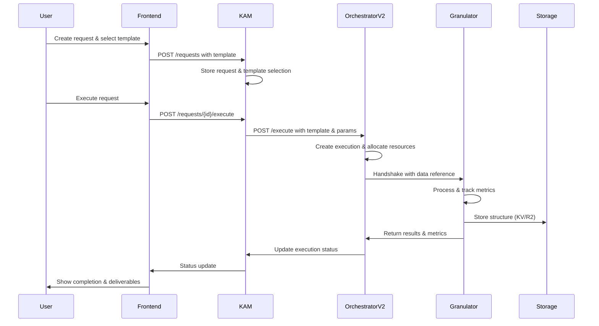

# AI Factory Workflow Integration - Next Steps

## 🎯 Current State Summary

### Deployed Components
1. **KAM (Key Account Manager)** - Central authentication and request management
   - URL: https://bitware-key-account-manager.jhaladik.workers.dev
   - Integrated with Orchestrator v2 for pipeline execution
   - Templates with multi-stage pipeline support

2. **Orchestrator v2** - Pipeline orchestration with resource management
   - URL: https://bitware-orchestrator-v2.jhaladik.workers.dev
   - Handshake protocol for worker communication
   - Resource tracking and allocation

3. **Content Granulator** - AI-powered content structuring
   - URL: https://bitware-content-granulator.jhaladik.workers.dev
   - 6 structure types: course, quiz, novel, workflow, knowledge_map, learning_path
   - Full handshake protocol support

4. **Frontend (Pages)** - Admin and client dashboards
   - URL: https://ai-factory-frontend.pages.dev
   - Template Manager with multi-stage pipeline configuration
   - Request management with status tracking

## 📊 Complete Workflow Architecture



## 🔄 Detailed Request Flow

### 1. Request Creation
```javascript
POST /api/kam/requests
{
  "client_id": "client_123",
  "request_type": "pipeline_execution",
  "message": "Create a comprehensive course on Machine Learning",
  "urgency_level": "normal"
}
```

### 2. Template Selection & Execution
```javascript
PUT /api/kam/requests/{request_id}
{
  "selected_template": "content_granulation_course",
  "template_confidence_score": 0.95
}

POST /api/kam/requests/{request_id}/execute
{
  "parameters": {
    "topic": "Machine Learning Fundamentals",
    "granularityLevel": 4,
    "targetAudience": "beginners",
    "validationEnabled": true,
    "validationLevel": 2
  }
}
```

### 3. Orchestrator Execution
KAM calls Orchestrator v2:
```javascript
POST https://orchestrator/execute
{
  "request_id": "req_123",
  "template_name": "content_granulation_course",
  "parameters": {
    "topic": "Machine Learning Fundamentals",
    "structureType": "course",  // Added by KAM based on template
    "granularityLevel": 4,
    "validationEnabled": true
  },
  "priority": "normal",
  "client_id": "client_123"
}
```

### 4. Worker Handshake
Orchestrator initiates handshake with Granulator:
```javascript
// Handshake Packet
{
  "packet_id": "packet_12345",
  "execution_id": "exec_456",
  "stage_id": "stage_1",
  "control": {
    "action": "continue",
    "priority": "normal",
    "timeout_ms": 30000
  },
  "data_ref": {
    "storage_type": "KV",
    "storage_key": "data/exec_456/stage_1/input",
    "size_bytes": 1024
  }
}
```

## 📈 Metrics & Cost Tracking

### Required Metrics from Workers

#### 1. **Token Usage** (for AI workers)
```javascript
{
  "tokens_used": {
    "prompt_tokens": 1250,
    "completion_tokens": 2500,
    "total_tokens": 3750
  },
  "model": "gpt-4o-mini",
  "cost_per_1k_tokens": 0.00015
}
```

#### 2. **Time Tracking**
```javascript
{
  "processing_time_ms": 18500,
  "breakdown": {
    "ai_generation_ms": 12000,
    "validation_ms": 4500,
    "storage_ms": 2000
  }
}
```

#### 3. **Resource Usage**
```javascript
{
  "resource_usage": {
    "api_calls": 2,
    "kv_operations": 5,
    "r2_operations": 1,
    "cpu_time_ms": 18500,
    "memory_mb": 128
  }
}
```

### Cost Calculation Formula
```javascript
total_cost = (tokens_used * cost_per_token) + 
             (api_calls * api_cost) + 
             (storage_operations * storage_cost) +
             (cpu_time_ms * cpu_cost_per_ms)
```

## 🚀 Next Implementation Tasks

### 1. **Enhanced Metrics Collection**

#### A. Update Granulator Response
```typescript
// In granulation-ops.ts
const result = {
  jobId: jobId,
  structure: generatedStructure,
  metrics: {
    tokensUsed: {
      prompt: promptTokens,
      completion: completionTokens,
      total: totalTokens
    },
    processingTimeMs: endTime - startTime,
    timeBreakdown: {
      aiGenerationMs: aiTime,
      validationMs: validationTime,
      storageMs: storageTime
    },
    costUsd: calculateCost(totalTokens, apiCalls),
    resourceUsage: {
      apiCalls: 2,
      kvOperations: kvOps,
      r2Operations: r2Ops
    }
  }
};
```

#### B. Update Worker Sessions in KAM
```sql
ALTER TABLE pipeline_worker_sessions ADD COLUMN IF NOT EXISTS
  tokens_used INTEGER DEFAULT 0,
  prompt_tokens INTEGER DEFAULT 0,
  completion_tokens INTEGER DEFAULT 0,
  time_breakdown TEXT, -- JSON with detailed timing
  resource_usage TEXT; -- JSON with resource metrics
```

### 2. **Orchestrator Metrics Aggregation**

```javascript
// In Orchestrator execution handler
async function aggregateExecutionMetrics(executionId) {
  const stages = await db.getStageExecutions(executionId);
  
  return {
    totalTokens: stages.reduce((sum, s) => sum + (s.tokens_used || 0), 0),
    totalCost: stages.reduce((sum, s) => sum + (s.cost_usd || 0), 0),
    totalTime: stages.reduce((sum, s) => sum + (s.execution_time_ms || 0), 0),
    breakdown: {
      byWorker: groupBy(stages, 'worker_name'),
      byResource: aggregateResourceUsage(stages)
    }
  };
}
```

### 3. **Dashboard Analytics Updates**

#### A. Request Details View
- Show token usage per stage
- Display time breakdown
- Cost breakdown by worker
- Resource utilization chart

#### B. Client Usage Dashboard
```javascript
// New metrics to display
{
  "monthly_tokens": 1250000,
  "monthly_cost_breakdown": {
    "ai_generation": 125.50,
    "api_calls": 15.25,
    "storage": 5.00,
    "compute": 8.75
  },
  "efficiency_metrics": {
    "avg_tokens_per_request": 3750,
    "avg_time_per_request": 18500,
    "cost_per_deliverable": 0.56
  }
}
```

### 4. **Multi-Stage Pipeline Enhancements**

#### A. Stage Dependencies
```javascript
{
  "pipeline_stages": [
    {
      "stage_index": 1,
      "worker_name": "topic_researcher",
      "depends_on": [],
      "output_validation": {
        "required_fields": ["research_summary", "key_points"],
        "min_quality_score": 0.8
      }
    },
    {
      "stage_index": 2,
      "worker_name": "bitware-content-granulator",
      "depends_on": [1],
      "input_mapping": {
        "topic": "{{stage_1.research_summary}}",
        "context": "{{stage_1.key_points}}"
      }
    }
  ]
}
```

#### B. Conditional Stage Execution
```javascript
{
  "conditional_stages": [
    {
      "condition": "{{stage_1.quality_score}} < 0.7",
      "action": "retry_stage",
      "params": { "max_retries": 2 }
    },
    {
      "condition": "{{stage_2.element_count}} > 100",
      "action": "add_stage",
      "stage": {
        "worker_name": "content_optimizer",
        "action": "optimize_large_structure"
      }
    }
  ]
}
```

## 🔍 Testing Checklist

### 1. End-to-End Flow
- [ ] Create request via Frontend
- [ ] Select granulator template
- [ ] Execute with custom parameters
- [ ] Monitor progress in real-time
- [ ] Verify deliverables storage
- [ ] Check token usage tracking
- [ ] Validate cost calculations

### 2. Multi-Stage Pipeline
- [ ] Create request with educational_content_pipeline
- [ ] Verify stage 1 (research) executes
- [ ] Check data passes to stage 2 (course structure)
- [ ] Verify stage 3 (quiz generation) uses course data
- [ ] Validate total metrics aggregation

### 3. Error Scenarios
- [ ] Worker timeout handling
- [ ] Validation failure retry
- [ ] Budget exceeded prevention
- [ ] Partial pipeline completion

## 🎯 Priority Implementation Order

1. **Token & Time Tracking** (Critical)
   - Update Granulator to return detailed metrics
   - Update KAM database schema for metrics
   - Update Orchestrator to aggregate metrics

2. **Cost Calculation** (High)
   - Implement cost calculation in each worker
   - Add cost tracking to execution records
   - Update client budget tracking

3. **Dashboard Analytics** (Medium)
   - Add metrics display to request details
   - Create usage analytics page
   - Add cost breakdown charts

4. **Advanced Pipeline Features** (Low)
   - Implement conditional stages
   - Add parallel stage execution
   - Create pipeline templates library

## 📝 Configuration Updates Needed

### 1. Environment Variables
```toml
# In each worker's wrangler.toml
[vars]
OPENAI_COST_PER_1K_TOKENS = "0.00015"
KV_OPERATION_COST = "0.0001"
R2_OPERATION_COST = "0.0002"
CPU_COST_PER_MS = "0.000001"
```

### 2. Database Migrations
```sql
-- For KAM
ALTER TABLE client_requests ADD COLUMN 
  total_tokens_used INTEGER DEFAULT 0,
  detailed_metrics TEXT; -- JSON

-- For Orchestrator
ALTER TABLE execution_stages ADD COLUMN
  tokens_used INTEGER DEFAULT 0,
  time_breakdown TEXT, -- JSON
  resource_metrics TEXT; -- JSON
```

## 🚦 Success Criteria

1. **Accurate Metrics**: Token counts match OpenAI usage
2. **Cost Tracking**: Within 5% of actual API costs
3. **Performance**: <100ms overhead for metrics collection
4. **Reliability**: 99.9% metrics capture rate
5. **Scalability**: Handle 1000+ concurrent executions

## 🛠️ Development Tools Needed

1. **Metrics Dashboard** - Real-time worker performance
2. **Cost Simulator** - Predict pipeline costs
3. **Load Testing** - Verify handshake under load
4. **Metric Validation** - Compare with provider dashboards

---

This document provides the complete workflow and next steps for implementing comprehensive metrics and cost tracking across the AI Factory system.